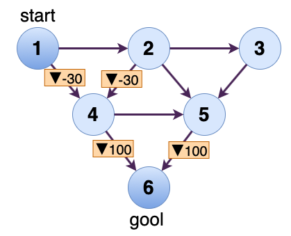

# Q-Learningによる最適経路

## 使い方
1. **./save** ディレクトリ内に，新しいディレクトリを作る．
2. 作成したディクトリ内に，**input.txt** を用意する ．
3. 学習．作成したディレクトリ名，エポック数を指定する．2回目以降は，既に学習した Q-Table を読み込み，学習が開始される．<br>
`$ python train.py dirname epoch`

4. 結果を表示する．<br>
`python result.py dirname`


## **input.txt** の記述法
グラフの形状，報酬を **input.txt** に記述する．
```
N s g
R_1 R_2 ... R_N
a_1 b_1
a_2 b_2
.
.
.
a_m g_m
```
- N： グラフのノード数
- s： startノード (1 <= s <= N)
- g： goolノード (1 <= g <= N)
- R_i： ノードiに移動した場合に与える報酬 (1 <= i <= N)
- a_i, b_i： a_i → b_iに移動可能 (1 <= a_i, b_i <= N)

## 例（**./save/example/**）

<div align="center">

</div>
<br>

上記のグラフを記述した **input.txt**
```
6 1 6
0 0 0 -30 0 100
1 2
1 4
2 3
2 4
2 5
3 5
4 5
4 6
5 6
```

1000エポック学習すると，結果は，1 → 2 → 5 → 6 となった．

```
$ python train.py example 1e3
$ python result.py example
```


